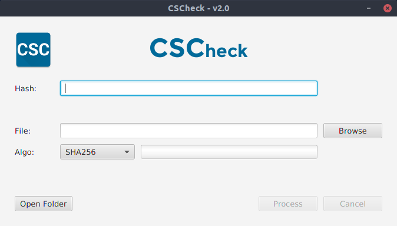

# CheckSum Check

A humble file hashing desktop application powered by JavaFx.
And moreover: my first complete personal project done while I was a student.

## Getting Started

First of all, pull this project with Git:

```bash
Using HTTPS:
git clone https://github.com/jeremiergz/cscheck.git

Using SSH:
git clone git@github.com:jeremiergz/cscheck.git
```

## Build & Execute

Building the executable jar can be done using then Maven command below:

```bash
mvn install
```

Generated executable jar will be placed in the *target* folder. You can then execute it using the following command:

```bash
java -jar ./target/cs-check-<version>-jar-with-dependencies.jar
```

A window looking more or less like below picture should pop up:



## Authors

* [**Jeremie Rodriguez**](https://github.com/jeremiergz) <[contact@jeremierodriguez.com](mailto:contact@jeremierodriguez.com)> - Main developer

## License

This project is licensed under the MIT license - see the [LICENSE](LICENSE) file for details.
